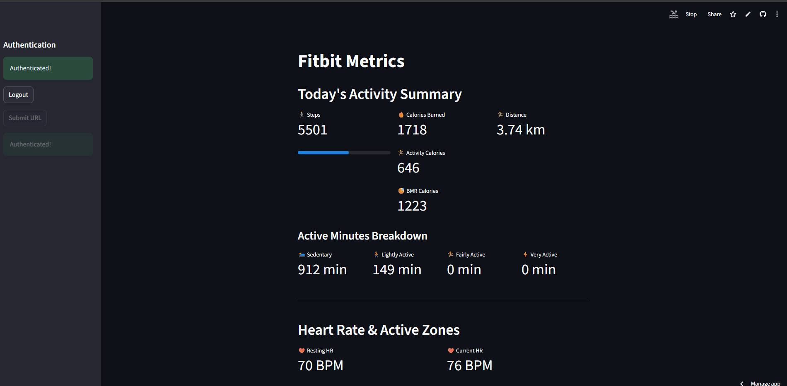

# Fitbit Metrics Dashboard


A simple Streamlit application to visualize your personal Fitbit activity data.  
This dashboard connects to the Fitbit API to fetch and display key metrics such as steps, calories, heart rate, and active zone minutes in a clean and easy-to-read format.

---

## Demo

Here’s what the dashboard looks like in action:

  
_Example dashboard view with steps, heart rate, and activity breakdown._

---

## Features

- **Activity Summary**: View daily steps, calories burned, and distance.
- **Active Minutes Breakdown**: See a breakdown of time spent in sedentary, lightly active, fairly active, and very active states.
- **Real-time Heart Rate**: Check your current and resting heart rate.
- **Heart Rate Zones**: Understand how much time you've spent in different heart rate zones (e.g., Fat Burn, Cardio).
- **Heart Rate Trend**: Visualize your heart rate trend over the day with a line chart.
- **Activities Log**: See a list of your logged activities for the day.

---

## Prerequisites

To run this application, you will need:

- Python **3.7+**
- A **Fitbit Developer Account** to create your own application and get API credentials.

---

## Setup and Configuration

### 1. Clone the Repository

```bash
git clone <repository-url>
cd <repository-name>
```

### 2. Install Dependencies

Install the required Python packages using pip.
It’s recommended to use a virtual environment.

```bash
pip install -r requirements.txt
```

### 3. Create and Configure a Fitbit App

- Go to the Fitbit Developer Dashboard and click Register an App.

- Fill out the required information. For the OAuth 2.0 Application Type, select Personal.

- Set the Callback URL to:

```python
REDIRECT_URI = 'http://localhost:8501'
```

(for local development — for deployment, add your app’s public URL later).

```python
REDIRECT_URI ='https://<your-streamlit-url>.streamlit.app'
```

- Copy your OAuth 2.0 Client ID and Client Secret.

### 4. Configure Your Secrets

For security, your API credentials should not be hardcoded.
This app uses Streamlit’s built-in secrets management.

- Create a new folder named .streamlit in the root of your project.

- Inside it, create a file named secrets.toml.

Your structure should look like this:

```bash
your-repo/
├── .streamlit/
│   └── secrets.toml
└── fitbit_streamlit_app.py
```

Add your Fitbit credentials to the secrets.toml file:

```bash
CLIENT_ID = "your_client_id"
CLIENT_SECRET = "your_client_secret"
```

⚠️ Important: Add .streamlit/secrets.toml to your .gitignore to prevent committing secrets.

## Running the Application (locally)

Once your credentials are set up, run the application:

```bash
streamlit run fitbit_streamlit_app.py
```

This will start the app and open it in your browser.
Follow the on-screen instructions to authorize the app with your Fitbit account.

Deployment

This application is ready for deployment on Streamlit Cloud (free tier available).

Push your code (excluding secrets.toml) to a public GitHub repository.

Go to the Streamlit Cloud dashboard
.

Click New app and connect to your repository.

In Advanced settings, add your CLIENT_ID and CLIENT_SECRET directly as secrets.

After deployment, update your Fitbit app’s Callback URL to your Streamlit app’s public URL, e.g.:

```python
REDIRECT_URI ='https://<your-streamlit-url>.streamlit.app'
```

---

License

This project is licensed under the MIT License.
